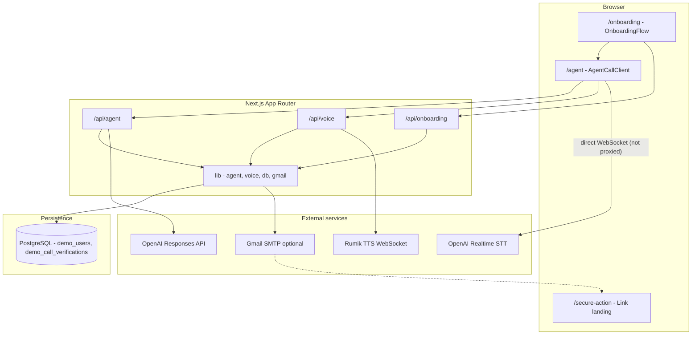
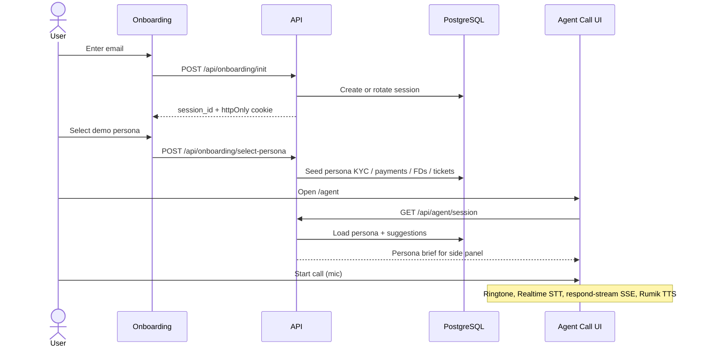
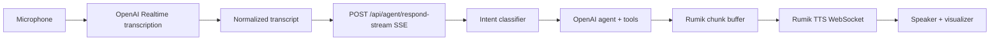

# Stable Money — Voice Agent Demo

A full-stack demo of **Stable Assist**, a Hindi-English voice support agent for Stable Money customers. Users pick a demo persona, start a live call, and speak naturally about KYC, payments, fixed deposits, refunds, and support tickets. The agent answers with policy-grounded tools, tiered verification, and streamed speech.

Built with **Next.js 15**, **React 19**, **PostgreSQL**, **OpenAI** (reasoning + transcription), and **Rumik** (text-to-speech over WebSocket).

---

## Table of contents

- [What this demo does](#what-this-demo-does)
- [Architecture](#architecture)
- [User journey](#user-journey)
- [Voice turn pipeline](#voice-turn-pipeline)
- [Agent brain](#agent-brain)
- [Authentication tiers](#authentication-tiers)
- [Demo personas](#demo-personas)
- [Known limitations](#known-limitations)
- [Project structure](#project-structure)
- [API reference](#api-reference)
- [Environment variables](#environment-variables)
- [Getting started](#getting-started)
- [Scripts](#scripts)
- [Testing](#testing)

---

## What this demo does

| Area | Behavior |
|------|----------|
| **Onboarding** | Email capture, persona selection, voice call |
| **Voice I/O** | OpenAI Realtime transcription (user speech) + Rumik TTS (agent speech) |
| **Reasoning** | OpenAI Responses API with function tools and streaming SSE |
| **Policy** | Intent routing, auth tiers (A / B / C), exact disclosure copy, canonical SLAs |
| **Verification** | Mobile last-4 + DOB gate before Tier B reads; persisted per call |
| **Actions** | Create support tickets and send secure links (demo email via Gmail SMTP) |
| **Data** | Persona seeds stored in Postgres; session cookie ties browser to demo_users |

This is a **demo assignment** — no real banking APIs, no production PII handling. Sensitive actions (e.g. premature withdrawal) stop at a secure link landing page.

---

## Architecture

High-level system view: browser UI, Next.js API routes, Postgres, and external AI/voice/email services. The OpenAI Realtime STT connection is opened directly from the browser as a WebSocket — it is not proxied through the Next.js server.



### Layer responsibilities

| Layer | Role |
|-------|------|
| **app/** | Routes and API handlers (thin; delegate to lib/) |
| **components/** | Onboarding UI, agent call UI, audio visualizer |
| **lib/agent/** | Policy, intents, OpenAI agent loop, tools, tickets, secure links |
| **lib/voice/** | Rumik streaming chunking, OpenAI STT/realtime, transcript normalization |
| **lib/** | Sessions, personas, DB pool, Gmail, DOB parsing |
| **migrations/** | Postgres schema for demo users and call verification |
| **tests/** | Node test runner (tsx --test) — 30+ test files |

---

## User journey



1. **/** redirects to **/onboarding**.
2. **Step 1 — Email:** Creates a session_id, sets an httpOnly cookie, upserts demo_users.
3. **Step 2 — Persona:** One of five seeded customers; full account snapshot written to the DB.
4. **/agent:** Loads session, shows persona panel and suggested questions, runs the voice loop.
5. **/secure-action:** Opens from emailed secure links (withdrawal demo only — no real transaction).

On **iOS**, a microphone permission gate runs before email entry (WebKit requires early getUserMedia).

---

## Voice turn pipeline

Each user utterance follows this path inside AgentCallClient:



**Low-latency details:**

- Agent replies stream over **SSE**; text is chunked (lib/voice/rumik-streaming.ts) before TTS so audio starts early.
- **Thinking fillers** (pre-cached Hindi phrases) play while tools or the model run.
- **Opening line** audio can be prefetched after session load.
- Optional **/api/voice/timing-log** for turn latency diagnostics.

---

## Agent brain

### Intent → policy → tools

1. **Classify** the user turn (lib/agent/intent-classifier.ts) into a StableIntentId (e.g. payment.failed, kyc.status, fd.withdraw.premature).
2. **Resolve route** (lib/agent/stable-policy.ts): auth tier + allowed tool names.
3. **Build prompt** (lib/agent/openai-agent.ts): persona context, project rules, exact lines, disclosure copy.
4. **Execute** via OpenAI Responses API with **function tools** (lib/agent/stable-tools.ts).
5. **Stream** tokens back through SSE; client speaks them via Rumik.

### Tool catalog

| Tool | Tier | Purpose |
|------|------|---------|
| verify_read_access | B | Mobile last-4 + DOB verification |
| lookup_customer_profile | B | Safe profile read |
| get_trust_facts | A | Public trust / company facts |
| get_canonical_slas | A | Approved timeline wording |
| get_disclosure_copy | A | Recording, FD, MF, tax disclosures |
| get_kyc_status | B | KYC state for verified caller |
| get_payment_reconciliation_status | B | Payment / UTR lookup |
| get_fd_booking_status | B | FD booking / payout status |
| get_premature_withdrawal_quote | B | Withdrawal estimate |
| get_fd_rates | A | Demo rate comparison (no recommendation) |
| get_support_ticket_status | B | Open ticket lookup |
| create_support_ticket | A/B | Persist ticket + optional email |
| send_secure_link | C | Email link to /secure-action |
| get_support_contact | A | Hours and contact reference |

Side effects (create_support_ticket, send_secure_link) update JSONB columns on demo_users and optionally send HTML email through **Gmail SMTP**.

### Verification model

- **Tier A:** No identity check (public facts, disclosures, rate compare).
- **Tier B:** Requires verify_read_access — last four digits of registered mobile, then DOB (AI semantic match with calendar fallback).
- **Tier C:** Tier B plus secure link for sensitive actions (e.g. premature withdrawal).

Verification state is keyed by **session_id + call_id** (in-memory + demo_call_verifications table) so DOB retries do not re-ask for mobile.

---

## Authentication tiers

| Tier | Typical intents | Verification |
|------|-----------------|--------------|
| **A** | Trust, disclosures, FD rates, KYC explainer, support hours | None |
| **B** | Payment status, KYC status, FD status, ticket status, summaries | Mobile + DOB |
| **C** | Premature withdrawal, secure actions | B + secure link flow |
| **A/B** | Grievance escalation | Ticket without full B read |

Policies live in STABLE_INTENT_POLICIES inside lib/agent/stable-policy.ts.

---

## Demo personas

Five fixed customers in lib/personas.ts — each with distinct KYC, payment, FD, ticket, and secure-link seeds:

| ID | Name | Scenario focus |
|----|------|----------------|
| cust_demo_001 | Ananya Sharma | Pending KYC + payment reconciliation + processing FD |
| cust_demo_002 | Rohan Mehta | Rejected KYC + refund path |
| cust_demo_003 | Priya Nair | Approved KYC + mature FD payout delay |
| cust_demo_004 | Vikram Patel | Multiple FDs + premature withdrawal secure link |
| cust_demo_005 | Meera Iyer | Open grievance ticket + escalation |

Selecting a persona overwrites the matching row in demo_users with that seed snapshot.

---

## Known limitations

This project is intentionally scoped as a demo. Three areas I want to call out explicitly before anyone considers running this at scale:

### No rate limiting on expensive endpoints

I have not added rate limiting to `/api/voice/deepgram-token`, `/api/voice/openai-transcribe`, `/api/voice/rumik-session`, `/api/agent/respond-stream`, or the OpenAI Realtime token endpoint. Any of these can burn provider quota quickly under load. The transcription endpoint also accepts uploaded audio without file-size validation. Before a production deployment I would add per-IP and per-session rate limits (via Redis / Upstash / Vercel KV), enforce upload size caps on audio, and require session validation on every token-minting endpoint.

### Session security is demo-grade

I pass `session_id` in plain URLs and request bodies in several places (e.g. onboarding redirects and secure link generation). The httpOnly and sameSite cookie flags are set correctly, but I have not set the `secure` flag, and the raw session identifier is exposed in links that a user could share. For a real deployment I would replace bare session IDs in URLs with signed, scoped, short-lived tokens, enforce the `secure` cookie flag, and scope each token to the specific action it authorises.

### Agent turns can get very expensive

A single user turn can chain intent classification, a streaming OpenAI response, multiple tool calls, recovery calls, STT, and TTS — all in sequence. The agent loop is currently configured with an 8 k output-token ceiling and up to 24 model rounds per turn. Without per-turn budgets, provider timeouts, and circuit breakers, a handful of simultaneous users asking complex questions can exhaust OpenAI quota or cause long tail latencies. I would reduce the maximum loop count significantly, add `AbortController` timeouts on every provider call, and enforce a hard elapsed-time cap per turn before treating this as production-ready.

---

## Project structure

```
stable-money-rumik/
├── app/
│   ├── page.tsx                 # redirect /onboarding
│   ├── onboarding/page.tsx      # Persona picker
│   ├── agent/page.tsx           # Voice call shell
│   ├── secure-action/page.tsx   # Secure link landing
│   └── api/
│       ├── onboarding/          # init, select-persona
│       ├── agent/               # session, respond, respond-stream
│       └── voice/               # rumik-session, openai-realtime-token, transcribe
├── components/
│   ├── onboarding/              # OnboardingFlow, PersonaCard, modal
│   ├── agent/                   # AgentCallClient (voice loop)
│   └── agents-ui/               # Audio visualizer bar
├── lib/
│   ├── agent/                   # Policy, tools, OpenAI agent, tickets, links
│   ├── voice/                   # Rumik + OpenAI voice helpers
│   ├── personas.ts              # Demo customer seeds
│   ├── onboarding-session.ts    # DB session helpers
│   ├── session-auth.ts          # Cookie + call verification
│   ├── db.ts                    # pg pool
│   └── gmail.ts                 # SMTP email templates
├── migrations/
│   └── 001_demo_users.sql
├── styles/                      # Onboarding + agent call CSS
├── tests/                       # Unit / integration tests
└── scripts/
    └── migrate.cjs              # Apply SQL migration
```

---

## API reference

| Method | Path | Description |
|--------|------|-------------|
| POST | /api/onboarding/init | Create session from email; set cookie |
| POST | /api/onboarding/select-persona | Persist persona seed to DB |
| GET | /api/agent/session | Persona, brief, suggested questions |
| POST | /api/agent/respond | Non-streaming agent turn (legacy path) |
| POST | /api/agent/respond-stream | **SSE** streaming agent turn (primary) |
| POST | /api/voice/openai-realtime-token | Client secret for Realtime STT |
| POST | /api/voice/openai-transcribe | Fallback batch transcription |
| POST | /api/voice/rumik-session | Rumik TTS WebSocket connect payload |
| POST | /api/voice/timing-log | Client-side latency events |

Protected routes accept session_id in the body and validate it against the httpOnly demo_session cookie.

---

## Environment variables

Copy .env.example to .env.local and fill in values.

> **Note:** All values in .env.example are fake placeholders. Do not commit real credentials.

### Required

| Variable | Purpose |
|----------|---------|
| DATABASE_URL | PostgreSQL connection string |
| OPENAI_API_KEY | Agent, intent classifier, STT, DOB verification |
| RUMIK_API_KEY | TTS WebSocket sessions |
| RUMIK_BASE_URL | Rumik API host (default https://silk-api.rumik.ai) |

### Optional

| Variable | Default | Purpose |
|----------|---------|---------|
| RUMIK_TTS_MODEL | muga | Rumik voice model |
| OPENAI_AGENT_MODEL | gpt-4o-mini | Main agent model |
| OPENAI_INTENT_MODEL | falls back to agent model | Intent classifier |
| OPENAI_STT_MODEL | gpt-4o-mini-transcribe | Batch STT |
| OPENAI_REALTIME_TRANSCRIBE_MODEL | STT model | Realtime transcription |
| OPENAI_REALTIME_TRANSCRIBE_LANGUAGE | — | Language hint |
| OPENAI_REALTIME_TRANSCRIPTION_USE_PROMPT | on for Whisper | Roman transcript prompt |
| STABLE_DISABLE_AI_DOB | off | Use strict date parse only (tests) |
| GMAIL_USER | — | SMTP username for demo emails |
| GMAIL_APP_PASSWORD | — | App password |
| GMAIL_FROM_NAME | Stable Assist | From display name |
| NEXT_PUBLIC_APP_URL / APP_BASE_URL | http://localhost:3000 | Secure link base URL |
| DEBUG_LOG_ALL | off | Verbose server logs |

DEEPGRAM_API_KEY and GEMINI_API_KEY in .env.example are **unused** (legacy placeholders; tests enforce no Gemini runtime paths).

---

## Getting started

### Prerequisites

- **Node.js** 20+
- **PostgreSQL** (local or hosted)
- API keys for **OpenAI** and **Rumik**

### Install and migrate

```bash
npm install

# Set DATABASE_URL in .env.local, then:
npm run migrate
```

### Run locally

```bash
npm run dev
```

Open http://localhost:3000 → onboarding → pick a persona → start the agent call.

**Microphone** access is required. Use HTTPS or localhost so the browser allows getUserMedia.

### Production build

```bash
npm run build
npm start
```

---

## Scripts

| Command | Description |
|---------|-------------|
| npm run dev | Next.js dev server |
| npm run build | Production build |
| npm start | Serve production build |
| npm run migrate | Run migrations/001_demo_users.sql |
| npm test | Run all tests under tests/ |
| npm run lint | ESLint (Next.js config) |

---

## Testing

Tests use Node's built-in runner via tsx:

```bash
npm test
```

Coverage includes agent tool auth, intent routing, SSE encoding, Rumik text chunking, session cookies, secure links, support tickets, onboarding flows, and UI-adjacent helpers. Tests mock external APIs — no live OpenAI/Rumik calls in CI by default.

---

## Design notes

- **Policy-first agent:** Business rules, exact Hindi/English lines, and SLAs live in code (stable-policy.ts), not only in the model prompt.
- **Tool-gated reads:** Account-specific data never returns before verify_read_access succeeds.
- **Streaming UX:** SSE + Rumik chunking minimizes time-to-first-audio.
- **Demo safety:** Secure actions open a confirmation page; emails are clearly marked as demo content.

---

## License

Private assignment project — not for production deployment without review.
